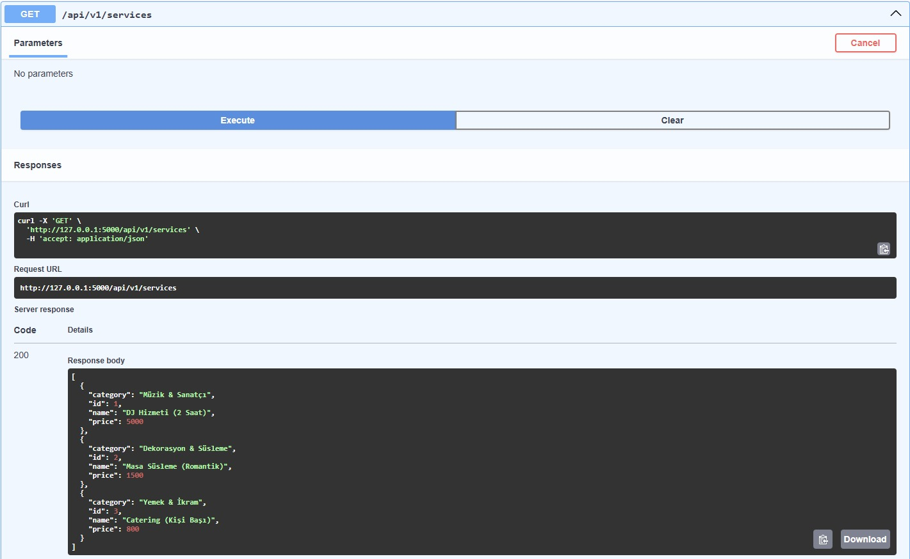
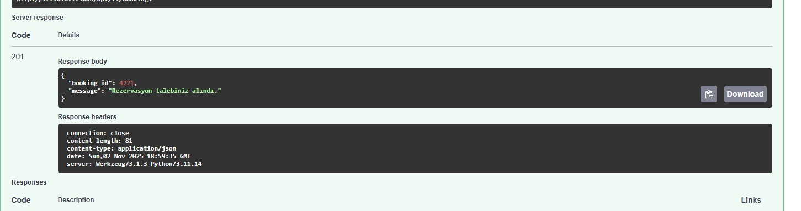
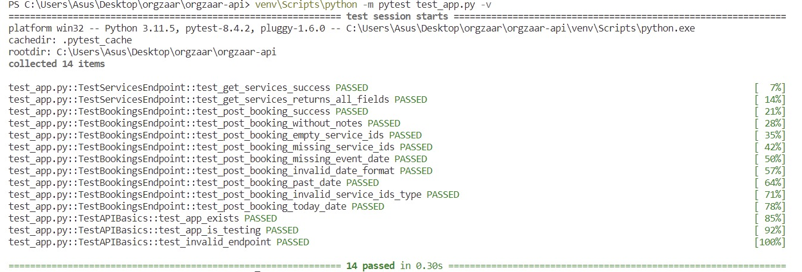

# orgzaar api

etkinlik hizmeti listeleme ve rezervasyon api'si.

## proje yapısı

```
orgzaar-api/
├── api/
│   ├── resources/
│   │   ├── services.py      # hizmet endpointleri
│   │   └── bookings.py      # rezervasyon endpointleri
│   └── schemas/
│       ├── service.py       # hizmet validasyonu
│       └── booking.py       # rezervasyon validasyonu
├── app.py                   # ana uygulama
├── test_app.py             # unit testler
├── requirements.txt        # bağımlılıklar
├── Dockerfile              # docker image tanımı
└── docker-compose.yml      # docker compose konfigürasyonu
```

## kurulum ve çalıştırma

### yöntem 1: manuel çalıştırma

```bash
# proje klasörüne git
cd C:\Users\Asus\Desktop\orgzaar\orgzaar-api

# virtual environment aktif et
venv\Scripts\activate

# bağımlılıkları yükle (ilk seferde)
pip install -r requirements.txt

# uygulamayı çalıştır
python app.py
```

uygulama `http://localhost:5000` adresinde çalışacaktır.

### yöntem 2: docker ile çalıştırma

```bash
# proje klasörüne git
cd C:\Users\Asus\Desktop\orgzaar\orgzaar-api

# docker desktop'ın çalıştığını kontrol et
docker ps

# docker compose ile başlat
docker-compose up -d

# logları görüntüle
docker-compose logs -f

# durdurmak için
docker-compose down
```

## api linkleri

uygulamayı çalıştırdıktan sonra:

- **swagger ui:** http://localhost:5000/swagger
- **hizmetler listesi:** http://localhost:5000/api/v1/services
- 
- **rezervasyon oluştur:** http://localhost:5000/api/v1/bookings (POST)
- 
- 


## testleri çalıştırma

```bash
# proje klasörüne git
cd C:\Users\Asus\Desktop\orgzaar\orgzaar-api

# virtual environment aktif et (manuel çalıştırma için)
venv\Scripts\activate


# testleri çalıştır
python -m pytest test_app.py -v

```

